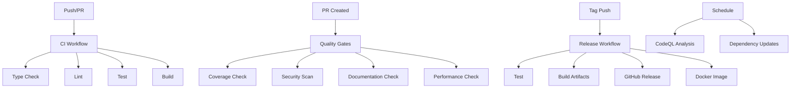

# GitHub Integration for Iconect MCP Server

This directory contains the GitHub Actions workflows and templates for the Iconect MCP Server project.

## 🚀 Workflows

### Core Workflows

1. **`ci.yml`** - Continuous Integration
   - Runs on every push/PR to main/develop
   - Tests across Node.js 18, 20, 22
   - Executes linting, type checking, tests, and build
   - Uploads coverage reports to Codecov
   - Includes security audit and dependency review

2. **`release.yml`** - Release Management
   - Triggered by version tags or manual dispatch
   - Creates GitHub releases with artifacts
   - Builds and pushes Docker images to GHCR
   - Optional NPM publishing (commented out)

3. **`codeql.yml`** - Security Analysis
   - Runs CodeQL analysis for security vulnerabilities
   - Scheduled weekly scans
   - Integrates with GitHub Security tab

4. **`quality-gates.yml`** - Quality Assurance
   - Comprehensive quality checks for PRs
   - Coverage thresholds, security scans
   - Performance and documentation validation
   - Build size monitoring

5. **`dependency-update.yml`** - Automated Maintenance
   - Weekly dependency updates
   - Automated testing of updates
   - Creates PRs for dependency bumps

## 📋 Templates

### Issue Templates

- **Bug Report** (`ISSUE_TEMPLATE/bug_report.md`)
  - Structured bug reporting with environment details
  - Error reproduction steps
  - Expected vs actual behavior

- **Feature Request** (`ISSUE_TEMPLATE/feature_request.md`)
  - Feature proposal with use cases
  - Implementation ideas and API impact
  - Priority and compatibility considerations

### Pull Request Template

- **`pull_request_template.md`**
  - Comprehensive PR checklist
  - Type of change classification
  - Testing and documentation requirements
  - Security and performance considerations

## 🏗️ CI/CD Pipeline Flow



## 🔒 Security Features

- **CodeQL Analysis**: Automated security vulnerability scanning
- **Dependency Review**: Blocks PRs with vulnerable dependencies
- **Security Audit**: Regular npm audit checks
- **SARIF Upload**: ESLint results integrated with GitHub Security

## 📊 Quality Metrics

### Coverage Requirements
- **Core Modules**: 80-90% coverage (auth, config)
- **Global Minimum**: 10% overall coverage
- **Quality Gate**: Fails if coverage drops below thresholds

### Performance Monitoring
- **Build Time**: Must complete within 120 seconds
- **Build Size**: Maximum 10MB distribution
- **Dependencies**: Limited to 20 production dependencies

### Code Quality
- **TypeScript**: Strict mode enforcement
- **ESLint**: Zero errors policy (warnings allowed)
- **Documentation**: Required files validation
- **TODO Limit**: Maximum 5 TODO/FIXME comments

## 🐳 Docker Support

### Multi-stage Build
- **Builder Stage**: Compiles TypeScript and installs dependencies
- **Production Stage**: Minimal Alpine image with only runtime dependencies
- **Security**: Non-root user, dumb-init for signal handling
- **Health Check**: Basic application health validation

### Container Registry
- Images pushed to GitHub Container Registry (GHCR)
- Multi-architecture support (AMD64, ARM64)
- Semantic versioning tags
- Latest tag for stable releases

## 🚀 Local Development

### Pre-commit Checks
```bash
# Run the full CI pipeline locally
npm run ci

# Individual checks
npm run typecheck
npm run lint
npm run test:coverage
npm run build
```

### Docker Testing
```bash
# Build and test Docker image
npm run docker:build
npm run docker:run
```

### Release Testing
```bash
# Test release scripts
npm run release:patch  # 1.0.0 -> 1.0.1
npm run release:minor  # 1.0.0 -> 1.1.0
npm run release:major  # 1.0.0 -> 2.0.0
```

## 🔧 Configuration

### Secrets Required
- `GITHUB_TOKEN`: Automatically provided
- `NPM_TOKEN`: For NPM publishing (optional)
- `CODECOV_TOKEN`: For coverage uploads (optional)

### Branch Protection Rules
Recommended settings for main branch:
- Require PR reviews (1+ reviewers)
- Require status checks (CI workflow)
- Require up-to-date branches
- Include administrators
- Restrict pushes to main

### Environment Variables
```bash
# Local development
NODE_ENV=development
LOG_LEVEL=DEBUG

# Production
NODE_ENV=production
LOG_LEVEL=INFO
```

## 📈 Monitoring

### Workflow Status
- All workflows report status to GitHub checks
- Failed builds block PR merging
- Coverage reports integrated with PR comments

### Performance Tracking
- Build time trends
- Test execution time
- Bundle size monitoring
- Dependency count tracking

## 🤝 Contributing

1. Fork the repository
2. Create a feature branch
3. Make changes following coding standards
4. Run `npm run ci` locally
5. Submit PR using the template
6. Ensure all quality gates pass

For detailed contribution guidelines, see [CONTRIBUTING.md](CONTRIBUTING.md).